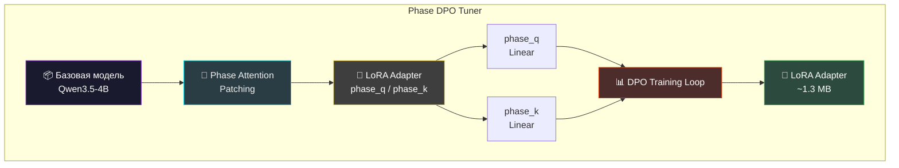
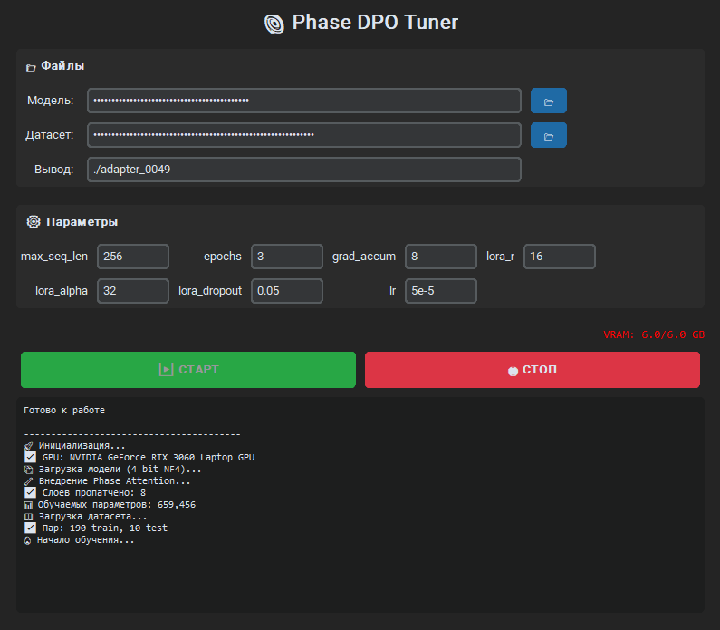

# Phase DPO Tuner

[](https://www.python.org/downloads/)
[](https://developer.nvidia.com/cuda-toolkit)
[](https://arxiv.org/abs/2305.18290)
[](https://customtkinter.com/)
[](LICENSE)

**Phase DPO Tuner** — это GUI-утилита для обучения кастомных Phase Attention слоёв методом Direct Preference Optimization (DPO). Система позволяет обучать LoRA-адаптеры на парах "правильный ответ / типичная ошибка", что делает модель устойчивой к логическим заблуждениям.

Проект решает задачу обучения не просто "правильным ответам", а **активному избеганию типичных ошибок** — критически важную возможность для моделей, работающих с рассуждениями и логикой.

<br>

## Ключевые Особенности

* **🧠 Phase Attention:** Кастомный attention-слой с фазовым кодированием. Позиции в последовательности кодируются через фазы, а их взаимодействие — через разность фаз (`cos(phase_q - phase_k)`).

* **📊 4-bit Квантизация:** Обучение на 6GB VRAM благодаря BitsAndBytes NF4. Модель загружается в 4-bit, что позволяет обучать даже на бюджетных видеокартах.

* **🎯 DPO (Direct Preference Optimization):** Обучение на парах chosen/rejected без необходимости в отдельной reward model. Модель учится увеличивать вероятность правильных рассуждений и уменьшать вероятность типичных ошибок.

* **🛡️ Отказоустойчивость:** Кнопка "СТОП" реально останавливает обучение через callback-механизм. Мониторинг VRAM в реальном времени с цветовой индикацией.

* **🖥️ GUI:** Тёмная тема, скрытые пути (для скриншотов), минималистичный интерфейс на CustomTkinter.

<br>

## Архитектура


┌─────────────────────────────────────────────────────────────┐
│                    Phase DPO Tuner                          │
├─────────────────────────────────────────────────────────────┤
│                                                             │
│   ┌──────────────┐    ┌──────────────┐    ┌─────────────┐  │
│   │  Базовая     │───►│    Phase     │───►│    LoRA     │  │
│   │   Модель     │    │  Attention   │    │  Adapter    │  │
│   │ (Qwen3.5-4B) │    │   Patching   │    │ (phase_q/k) │  │
│   └──────────────┘    └──────────────┘    └─────────────┘  │
│          │                   │                    │        │
│          │                   ▼                    │        │
│          │         ┌──────────────┐              │        │
│          │         │   phase_q    │◄─────────────┘        │
│          │         │   phase_k    │   Обучаемые           │
│          │         │  (Linear)    │   параметры           │
│          │         └──────────────┘                       │
│          │                   │                            │
│          ▼                   ▼                            │
│   ┌─────────────────────────────────────────────────────┐ │
│   │              DPO Training Loop                       │ │
│   │  Loss = -log(σ(β · log(π_θ(chosen) / π_θ(rejected))))│ │
│   └─────────────────────────────────────────────────────┘ │
│                          │                                 │
│                          ▼                                 │
│              ┌──────────────────────┐                     │
│              │   LoRA Adapter (~1MB) │                     │
│              │   adapter_config.json │                    │
│              │   adapter_model.safetensors │              │
│              └──────────────────────┘                     │
└─────────────────────────────────────────────────────────────┘
```

<br>

## Phase Attention: Техническое Описание

Кастомный слой, который добавляется к стандартному attention механизму:

```python
class PhaseAttentionHybrid(torch.nn.Module):
    """
    Фазовое кодирование для attention-механизма.
    LoRA обучает только phase_q и phase_k.
    """
    
    def __init__(self, base_attn, config):
        self.base_attn = base_attn
        self.phase_q = Linear(hidden_size, num_heads)  # обучается
        self.phase_k = Linear(hidden_size, num_heads)  # обучается

    def forward(self, hidden_states):
        # Базовый attention
        attn_output = self.base_attn(hidden_states)
        
        # Фазовая модуляция
        phase_factor = cos(phase_q - phase_k)
        phase_mod = phase_factor.mean(dim=(2, 3))
        
        # Модуляция выхода
        return attn_output * (1.0 + 0.1 * phase_mod)
```

**Инициализация нулями:** При старте `phase_q` и `phase_k` инициализируются нулями, поэтому модель начинается с поведения базовой модели. LoRA постепенно "выбирает" нужные фазовые паттерны.

<br>

## DPO: Методология Обучения

Direct Preference Optimization обучает модель на парах (prompt, chosen, rejected):

| Компонент | Описание |
|-----------|----------|
| **Prompt** | Вопрос или задача |
| **Chosen** | Правильное пошаговое рассуждение |
| **Rejected** | Типичная ошибка с неверной логикой |

**Loss Function:**
```
L_DPO = -E[log(σ(β · (log π_θ(y_chosen|x) - log π_θ(y_rejected|x))))]
```

Модель учится не только "что правильно", но и "почему типичные ответы неверны".

<br>

## Mission Control: GUI



**Особенности интерфейса:**

* **Скрытые пути:** Пути к файлам отображаются как `••••••` для защиты приватных данных на скриншотах.

* **Цветовая индикация VRAM:** Зелёный (< 70%), оранжевый (70-90%), красный (> 90%).

* **Минималистичный лог:** Только важная информация без технического шума.

<br>

## Установка и Конфигурация

### Требования

| Параметр | Минимум | Рекомендуется |
|----------|---------|---------------|
| Python | 3.10+ | 3.11+ |
| CUDA | 12.1+ | 12.1+ |
| VRAM | 6GB | 8GB+ |
| RAM | 8GB | 16GB+ |

### Быстрая Установка (Windows)

```bash
run_phase_trainer.bat
```

При первом запуске скрипт автоматически создаст venv и установит все зависимости.

### Ручная Установка

```bash
# Клонировать репозиторий
git clone https://github.com/iimasterii/phase-dpo-tuner.git
cd phase-dpo-tuner

# Создать виртуальное окружение
python -m venv venv
venv\Scripts\activate  # Windows
source venv/bin/activate  # Linux/Mac

# Установить PyTorch с CUDA
pip install torch torchvision --index-url https://download.pytorch.org/whl/cu121

# Установить transformers из main-ветки (для Qwen3.5)
pip install "git+https://github.com/huggingface/transformers.git@main"

# Установить остальные зависимости
pip install peft trl bitsandbytes accelerate customtkinter datasets

# Запуск
python phase_trainer_gui.py
```

<br>

## Формат Датасета

Датасет — это JSONL-файл, где каждая строка содержит три поля:

```json
{"prompt": "Вычисли: 10 + 20 * 2", "chosen": "Сначала умножение: 20 * 2 = 40. Затем сложение: 10 + 40 = 50.", "rejected": "Слева направо: 10 + 20 = 30. Умножаем: 30 * 2 = 60."}
{"prompt": "Если дождь → асфальт мокрый. Асфальт мокрый. Идёт дождь?", "chosen": "Нет. Из мокрого асфальта не следует дождь — могли полить из шланга.", "rejected": "Да, раз асфальт мокрый, значит идёт дождь."}
```

| Поле | Описание |
|------|----------|
| `prompt` | Вопрос или задача |
| `chosen` | Правильное рассуждение с объяснением |
| `rejected` | Типичная ошибка с логическим изъяном |

**Рекомендуемый размер:** 100-500 пар для DPO. Большие датасеты требуют более длительного обучения.

<br>

## Параметры Обучения

| Параметр | По умолчанию | Описание |
|----------|-------------|----------|
| `max_seq_len` | 256 | Максимальная длина последовательности |
| `epochs` | 3 | Количество эпох |
| `grad_accum` | 8 | Gradient accumulation steps |
| `lora_r` | 16 | LoRA rank |
| `lora_alpha` | 32 | LoRA alpha (обычно 2 × rank) |
| `lora_dropout` | 0.05 | LoRA dropout |
| `lr` | 5e-5 | Learning rate |

**Важно:** Параметры по умолчанию оптимизированы для 6GB VRAM.

<br>

## Результаты Обучения

После завершения в папке вывода появится:

```
./adapter_XXXX/
└── phase_dpo_adapter/
    ├── adapter_config.json      # Конфигурация LoRA
    ├── adapter_model.safetensors # Веса (~1.3 MB)
    └── README.md                 # Метаданные
```

### Загрузка на HuggingFace

```python
from huggingface_hub import HfApi

api = HfApi()
api.upload_folder(
    folder_path="./phase_dpo_adapter",
    repo_id="your-username/your-model",
    repo_type="model"
)
```

<br>

## Использование Обученного Адаптера

```python
import torch
from transformers import AutoModelForCausalLM, AutoTokenizer
from peft import PeftModel

# Phase Attention Layer (обязательно!)
class PhaseAttentionHybrid(torch.nn.Module):
    def __init__(self, base_attn, config):
        super().__init__()
        self.base_attn = base_attn
        self.phase_q = torch.nn.Linear(config.hidden_size, config.num_attention_heads)
        self.phase_k = torch.nn.Linear(config.hidden_size, config.num_attention_heads)
    
    def forward(self, *args, **kwargs):
        hidden_states = args[0]
        attn_output = self.base_attn(*args, **kwargs)
        if isinstance(attn_output, tuple):
            attn_output = attn_output[0]
        phase_factor = torch.cos(self.phase_q(hidden_states) - self.phase_k(hidden_states))
        return attn_output * (1.0 + 0.1 * phase_factor.mean(dim=-1, keepdim=True))

# Загрузка
model = AutoModelForCausalLM.from_pretrained("Qwen/Qwen3.5-4B", torch_dtype=torch.bfloat16, device_map="auto")

# Patching
for layer in model.model.layers:
    if hasattr(layer, 'self_attn'):
        layer.self_attn = PhaseAttentionHybrid(layer.self_attn, model.config)

# LoRA
model = PeftModel.from_pretrained(model, "your-username/your-model")
```

<br>

## Связанные Проекты

* [dpo-phase-logic](https://huggingface.co/IImasterII/dpo-phase-logic) — Пример обученного адаптера на 200 парах рассуждений

<br>

## Инженерные Решения

### Monkey Patching для Совместимости

Некоторые модели (например, Qwen3.5) требуют патчинга transformers:

```python
import transformers.models.auto.modeling_auto as modeling_auto
if not hasattr(modeling_auto, "MODEL_FOR_VISION_2_SEQ_MAPPING_NAMES"):
    modeling_auto.MODEL_FOR_VISION_2_SEQ_MAPPING_NAMES = OrderedDict()
```

### Инициализация Нулями

Phase-слои инициализируются нулями, что гарантирует идентичность базовой модели в начале обучения:

```python
torch.nn.init.zeros_(self.phase_q.weight)
torch.nn.init.zeros_(self.phase_k.weight)
```

### Graceful Stop

Остановка обучения через callback, а не принудительное прерывание потока:

```python
class StopEventCallback(TrainerCallback):
    def on_step_end(self, args, state, control, **kwargs):
        if self.stop_event.is_set():
            control.should_training_stop = True
        return control
```

<br>

---

## Disclaimer

Данное программное обеспечение предоставляется "как есть" (AS IS) без каких-либо гарантий. Автор не несёт ответственности за результаты обучения моделей, качество сгенерированных адаптеров или любой ущерб, возникший в результате использования.

Обученные модели могут наследовать предвзятости и ошибки базовой модели. Всегда проверяйте результаты перед использованием в продакшене.

---

## Автор

**IImasterII**
*AI Engineer | Python Developer*
